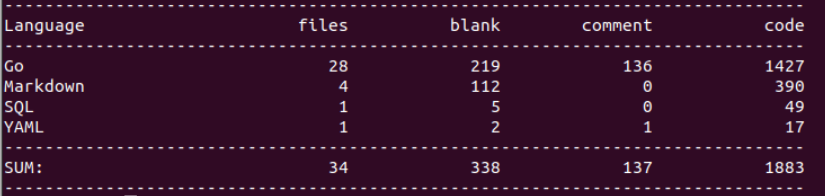
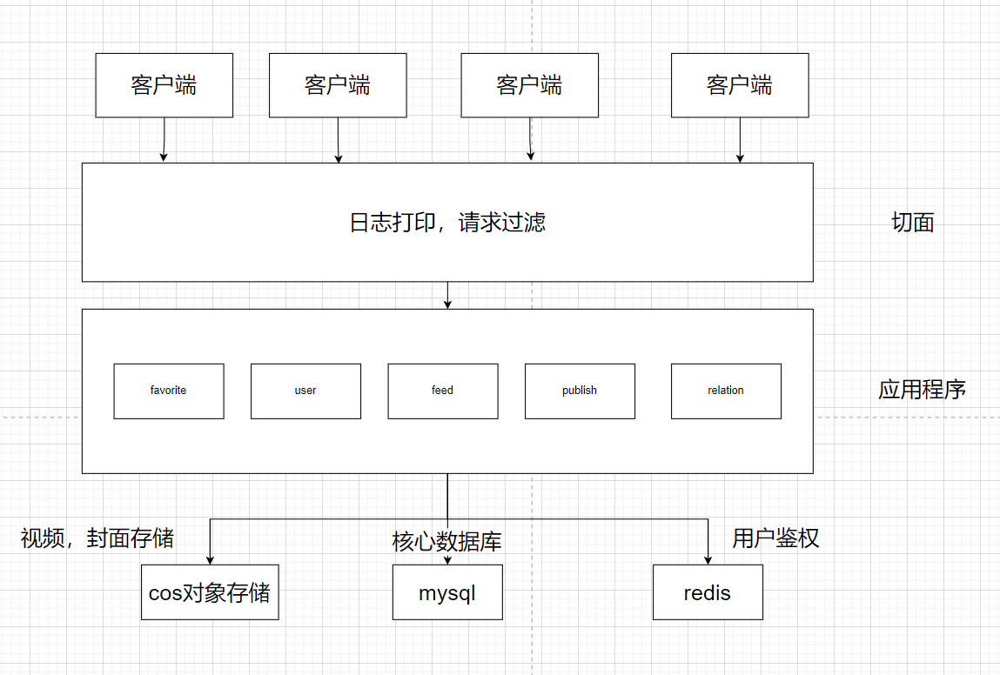

# Tiktok     
字节跳动第三届青训营，极简抖音后端项目

秉承着Go语言简洁的风格，不到1500行的代码，有大约10%的注释，麻雀虽小，五脏俱全。

#### 已完成接口

| 接口       | 说明                                                     |
| ---------- | -------------------------------------------------------- |
| 基础接口   | 用户注册、用户登录、用户信息、视频流、投稿接口、发布列表 |
| 拓展接口一 | 赞操作、点赞列表、评论操作、评论列表                     |
| 拓展接口二 | 关注操作、关注列表，粉丝列表                             |

#### 整体结构

#### 视频流和点赞
[演示地址](http://124.223.112.154/demo/%E8%A7%86%E9%A2%91%E6%B5%81%E7%82%B9%E8%B5%9E.mp4)

